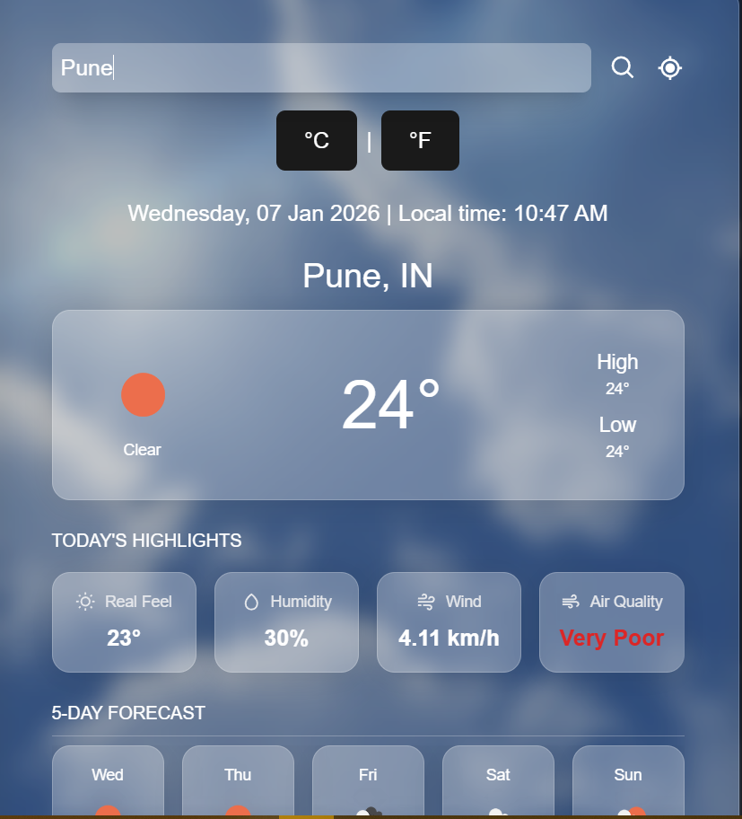

# 🌦️ Advanced Weather Dashboard | CODTECH Task 1


### 🚀 [View Live Demo](https://codtech-task1-weather-dashboard.vercel.app/)

## 📄 Project Description
This project is a **Level 3 Advanced Weather Dashboard** developed as part of the **CODTECH IT SOLUTIONS Internship program (Task 1)**. 

The application is built using **React.js** and **Tailwind CSS**, featuring a modern **Glassmorphism** user interface. It fetches real-time data from the OpenWeatherMap API to provide users with current weather conditions, extensive forecasts, and air quality metrics for any city globally.

## ✨ Key Features
*   **🌍 Global Search:** Instantly fetch weather data for any city worldwide.
*   **🎨 Dynamic Backgrounds:** The app background changes automatically based on the weather condition (Clear, Rain, Snow) and time of day (Day/Night).
*   **🔮 5-Day Forecast:** Accurate predictions for upcoming daily weather.
*   **❄️ Glassmorphism UI:** A trendy, translucent design aesthetic for a premium look.
*   **🌡️ Unit Conversion:** Toggle between Celsius (°C) and Fahrenheit (°F).
*   **🍃 Air Quality Index (AQI):** Displays real-time air pollution levels.
*   **📍 Local Time Integration:** Shows the correct local time and date for the searched location (handling Time Zones).
*   **📱 Fully Responsive:** Optimized for both Desktop and Mobile devices.

## 🛠️ Tech Stack
*   **Frontend Library:** React.js (Vite)
*   **Styling:** Tailwind CSS
*   **API:** OpenWeatherMap API
*   **Icons:** React Icons
*   **State Management:** React Hooks (useState, useEffect)
*   **Notifications:** React Toastify
*   **Date/Time:** Luxon

## 📸 Screenshots
  

## ⚙️ Installation & Setup

If you want to run this project locally, follow these steps:

1.  **Clone the repository**
    ```bash
    git clone https://github.com/YOUR_USERNAME/codtech-task1-weather.git
    cd codtech-task1-weather
    ```

2.  **Install Dependencies**
    ```bash
    npm install
    ```

3.  **Configure API Key**
    Create a `.env` file in the root directory and add your OpenWeatherMap API key:
    ```env
    VITE_WEATHER_API_KEY=your_api_key_here
    VITE_WEATHER_BASE_URL=https://api.openweathermap.org/data/2.5
    ```

4.  **Run the Project**
    ```bash
    npm run dev
    ```

## 📧 Contact & Internship Details
*   **Developer:** PRANATHI G R
*   **Internship:** CODTECH IT SOLUTIONS
*   **Task:** Task 1 - Weather Dashboard
*   **ID:** CTISAK77

---
*Made with ❤️ using React.*
